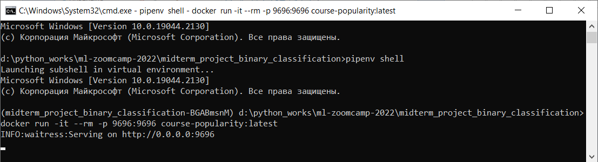
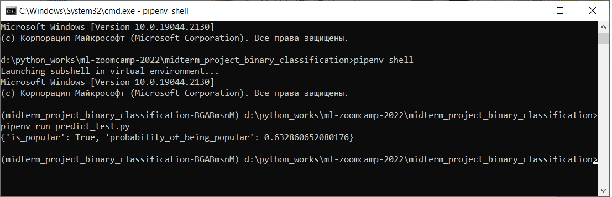
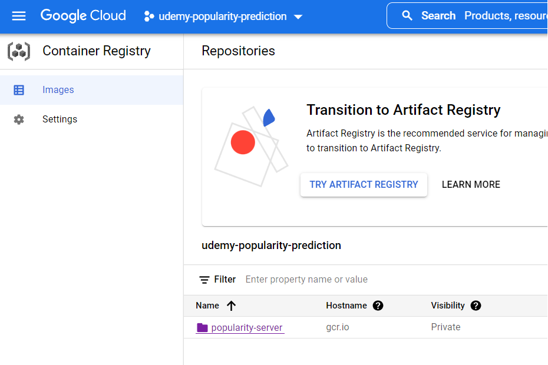
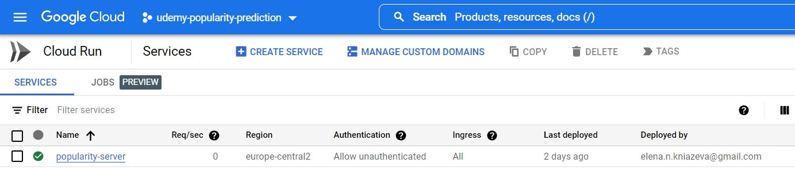
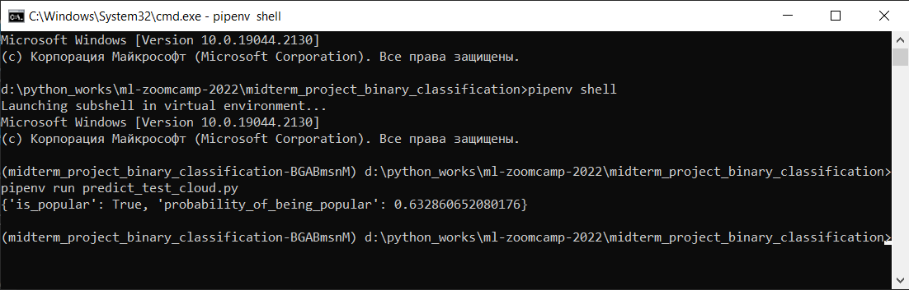

# **Prediction of udemy courses popularity**  
   
## **Table of contents:**  
   
- [About the project](#about-the-project)   
- [Structure of the repository](#structure-of-the-repository)   
- [Dataset description](#dataset-description)   
- [Virtual environment](#virtual-environment)  
- [Data preparation](#data-preparation)   
- [Machine Learning Models](#machine-learning-models)    
- [Running a web service in a local server](#running-a-web-service-in-a-local-server)    
- [Running a web service in a cloud](#running-a-web-service-in-a-cloud)   
- [Contacts](#contacts)   
   
## **About the project**   
   
This project is aimed to create a machine learning model for prediction of a popularity of an arbitrary course, which an author is going to place at Udemy learning platform. The author just needs to send to the model a few parameters to predict, whether the course will be popular:    
* 'course_id' - arbitrary id of a course (int)    
* 'is_paid' - 'yes' for paid course / 'no' for free course    
* 'price' - value for paid course of 0 for free one (int)    
* 'num_lectures' - number of lectures in the course (int)    
* 'level' - level of the course: 'All Levels', 'Beginner Level', 'Intermediate Level', 'Expert Level'    
* 'content_duration' - duration of the course in hours (float),    
* 'subject' - field of a course: 'Graphic Design', 'Web Development', 'Business Finance', 'Musical Instruments'    
   
Developed ML model is realized as a web service and deployed to the Google Cloud Platform.    
   
## **Structure of the repository**    
   
The repository contains the next files and folders:
* `images` - folder with images to README.md   
* `README.md` - project documentation    
* `udemy_courses.csv` - initial dataset    
* `notebook.ipynb` - a notebook with exploratory data analysis and ML model development     
* `model.bin` - a stored final model    
* `Pipfile` and `Pipfile.lock` - files with virtual environment for project    
* `train.py` - a python script to train the model    
* `predict.py` - a python script to create a web service on the base of developed final ML model    
* `Dockerfile` - to containerize the developed model    
* `predict_test.py` - a a python file to test and work with the locally deployed  model    
* `predict_test_cloud.py` - a python file to test and work with the model, deployed to Google Cloud Platform    
   
## **Dataset description**    
   
Dataset source is: https://www.kaggle.com/datasets/andrewmvd/udemy-courses . This dataset contains 3.678 records of courses from 4 subjects (Business Finance, Graphic Design, Musical Instruments and Web Design) taken from Udemy.     
Columns of the dataset are listed below:    
* course_id              
* course_title           
* url                
* is_paid (True/False)               
* price                  
* num_subscribers        
* num_reviews            
* num_lectures           
* level ('All Levels', 'Beginner Level', 'Intermediate Level', 'Expert Level')                 
* content_duration       
* published_timestamp (date of publication of a course)   
* subject ('Graphic Design', 'Web Development', 'Business Finance', 'Musical Instruments')               

## **Virtual environment**   
   
Virtual environment of the project is provided by `Pipfile` and `Pipfile.lock`. These files contain all information about libraries and dependencies for the project. To create a virtual environment with libraries and dependencies required for the project, one should install `pipenv` library:  
   
`pip install pipenv`   
   
Then it's necessary to clone this repository from GitHub, open a terminal in the folder with this repository, and run the following commands:   
   
`pipenv install`   # to install project virtual environment
`pipenv shell`     # to activate virtual environment

This virtual environment is also used for `notebook.ipynb` file. To open this file one should enter all previous commands and then start Jupyter Notebook by entering the next command in a terminal (command window):  
    
`pipenv run jupyter notebook`   
   
Then you should find `notebook.ipynb` file and open it.

## **Data preparation**    
   
Dataset preparation and exploratory data analysis are performed in a `notebook.ipynb` file.   
   
Initial dataset doesn't contain explicit data about a popularity of courses, but it has an information about number of subscribers. In this project a "popularity" of a course is defined as a ratio of a number of subscribers to an age of a course. An "age" of a course is defined as a difference between the date of uploading of a course ('published_timestamp' column) and the date of data scraping. During the analysis of popularity distribution, it was obtained that there were 8 observations with extremely high popularity (0.2% of all dataset). They all were from "web development" area (0.67% of all courses from this area). As the percentage of extremely popular courses was not high these observations were considered as outliers, and they were dropped out of a consideration.     
   
Exploratory data analysis (EDA) was performed. It was obtained that the distribution of a target value 'popularity' is similar to a Poisson distribution. In this project target variable mean value depends significantly on just a few observations (most popular courses). In such case median value is more stable. That is why a median value is set as a threshold to consider courses popular/unpopular, i.e. a course is considered to be popular if it's popularity is greater than median of all courses' popularities. Thus 'popularity' target variable was converted to variable with 0/1 values.    

Based on the business task modeling was performed for the next features:
* 'course_id',   
* 'is_paid'   
* 'price'   
* 'num_lectures'   
* 'level'   
* 'content_duration'   
* 'subject'   
* and target variable 'popularity'.   
   
Feature importance analysis was also performed in the frame of EDA. It was obtained, that a target value 'popularity' depends significantly on a 'subject' of a course. The fact of whether a course is free of charge or not plays less important role. And the level of a course effects just slightly on a target value 'popularity'. Correlation analysis showed that 'price', 'content_duration' and 'num_lectures' effect on a target value almost equally. But their effect is not significant.   
   
## **Machine Learning Models**   
   
Development of ML models and parameters tuning are also performed in a `notebook.ipynb` file.   
   
Three classifier models are built:   
* linear regression classifier model with tuned parameters. It's ROC-AUC score is equal to 0.770 on validation dataset     
* decision tree classifier model with tuned parameters. It's ROC-AUC score is equal to 0.824 on validation dataset     
* random forest classifier model with tuned parameters. It's ROC-AUC score is equal to 0.838 on validation dataset     
   
Random forest classifier model is selected as a final model. It's parameters:   
`n_estimators = 148`,   
`max_depth = 9`,   
`min_samples_leaf = 3`   
The model was trained on test+validation dataset and showed ROC-AUC score of 0.835 on test dataset.   

## **Running a web service in a local server**   
      
Developed final model is implemented in a web service. To run it it's necessary to install `Docker`, create a container (which contains all system dependencies, libraries, scripts and others) and run it.   
   
`Docker` may be installed from the official site https://www.docker.com/

File `Dockerfile` of the current repository (or cloned to your PC) contains all specifications to a container to be built: python, virtual environment, scripts and model file etc. To build a container one should start a `Docker`, open a terminal or command window and enter the next command:   
   
`docker build -t course-popularity .`   
   
Ones your docker container is built, you can run it with the next command:   
   
`docker run -it --rm -p 9696:9696 course-popularity:latest`   
   
The result of the command is to be running local server, like shown at the image below:   
   
 
   

   
 
   
Then you may check the result of web application's work. You should open other command window (or terminal), activate virtual environment (as described above: `pipenv shell`) and run a script `predict_test.py` with the next command:    
    
`pipenv run predict_test.py`   
   
A script `predict_test.py` sends to the local server a course with the next features:   
{'course_id' : 1009622,   
 'is_paid' : 'yes',   
 'price' : 80,   
 'num_lectures' : 43,   
 'level' : 'Beginner Level',   
 'content_duration' : 5.5,   
 'subject' : 'Graphic Design'   
 }   
The result of script's work should be as follows:   
   
 
   

   
 
   
The results obtained mean that the course will be popular with the probability 0.633   
   
You can also change features in `predict_test.py` and calculate popularity of an arbitrary course.   
   
## **Running a web service in a cloud**   
   
The web service is also deployed to Google Cloud Platform (Cloud Run) with the next commands:   
      
`gcloud config set project udemy-popularity-prediction`  # create a project   
   
`docker images`   # obtain a list of docker images to get exactly the name of needed image   
   
`docker tag course-popularity:latest gcr.io/udemy-popularity-prediction/popularity-server`  # create a tag to image   
   
`docker push gcr.io/udemy-popularity-prediction/popularity-server` # push image to Google Container Registry   
   
`gcloud run deploy popularity-server --image gcr.io/udemy-popularity-prediction/popularity-server --port 9696 --platform managed --region europe-central2`    # deploy image   

As result of `docker push ... ` command you container appeared in Google Container Registry   
   
 
      

     
 
   
The result of `gcloud run deploy ...` command will be a running server   
   
 
   

   
 

Web service is available on URL: https://popularity-server-srfockrmzq-lm.a.run.app/predict  The page can’t be loaded, because this URL ends with method, but the URL works perfect within a script.
   
You may check the result of web application's work. You should open command window (or terminal), activate virtual environment (as described above: `pipenv shell`) and run a script `predict_test_cloud.py` with the next command:     
`pipenv run predict_test_cloud.py`   
   
`predict_test.py` script send to local server a course with the next features:   
{'course_id' : 1009622,   
 'is_paid' : 'yes',   
 'price' : 80,   
 'num_lectures' : 43,   
 'level' : 'Beginner Level',   
 'content_duration' : 5.5,   
 'subject' : 'Graphic Design'   
 }   
The result of script's work should be as follows:  \

 
   

   
 
   
The results obtained mean that the course will be popular with the probability 0.633   
   
You can also change features in `predict_test_cloud.py` and calculate popularity of argbitrary course.  

## **Contacts**   
   
If you have any suggestions or comments about this project, please contact me via LinkedIn (https://www.linkedin.com/in/alena-kniazeva-a907bb197/ ) or email (elena.n.kniazeva@gmail.com).  
