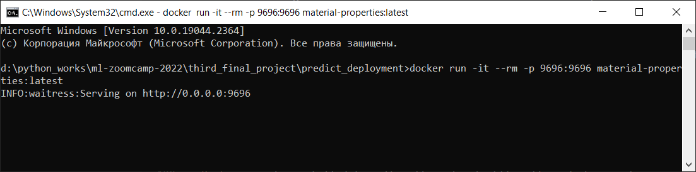
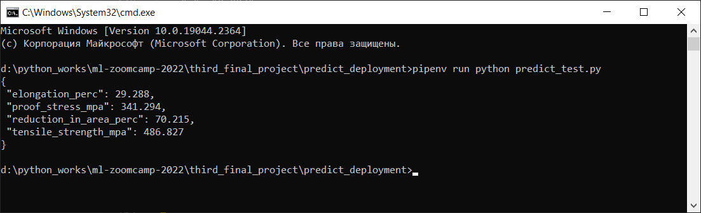
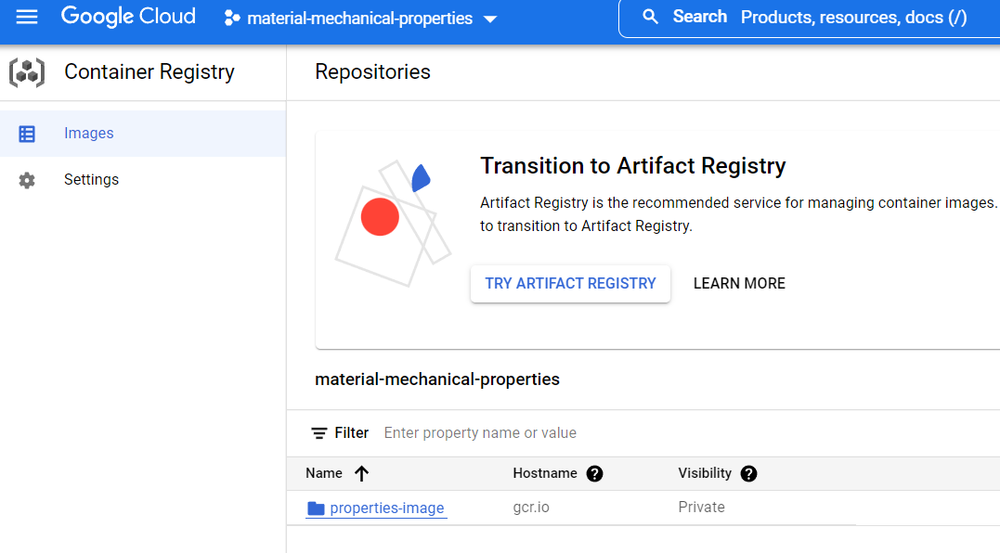
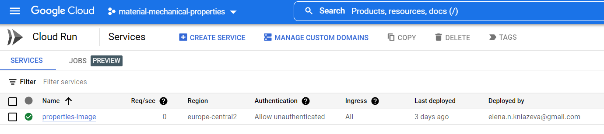
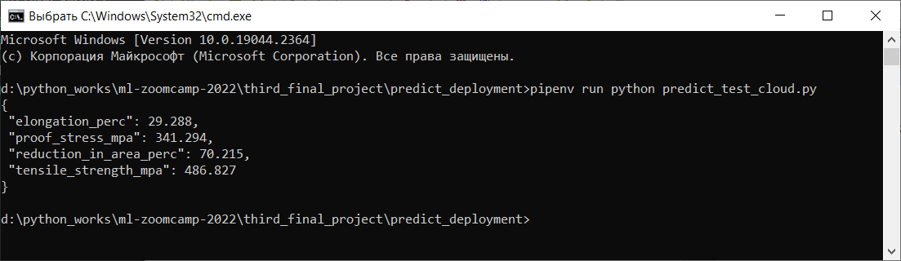

# **Prediction of mechanical properties of a low-alloy steel on the base of its structural components**  
   
## **Table of contents:**  
   
- [About the project](#about-the-project)   
- [Structure of the repository](#structure-of-the-repository)   
- [Dataset description](#dataset-description)   
- [Virtual environment](#virtual-environments)   
- [Considered Models](#development-of-ml-model)    
- [Running a web service in a local server](#running-a-web-service-in-a-local-server)    
- [Running a web service in a cloud](#running-a-web-service-in-a-cloud)   
- [Contacts](#contacts)   
   
## **About the project**   
   
Material Informatics is a very perspective field of knowledge. It allows to use machine learning technologies to obtain a new sense from a huge amount of gathered experimental data about mechanical properties of definite materials.

A determination of a dependency of material properties from a structure or a composition of a material is one of the core fundamental problems while new materials creation. This problem may be solved in the frame of Material Informatics with methods of machine learning. Given an experimental data about structure components and mechanical properties of existing (known) materials, one can build a ML-models to predict properties of some new material on the base of its structure.

The problem above is explored for a case of low-alloy steels in the frame of this project.

The aim of this project is to build multi-target regression ML-model, which allows to predict proof stress, tensile strength, elongation, reduction in area of low-alloy steel with a given temperature and percentages of structural elements.
   
Developed ML model is realized as a web service and deployed to the Google Cloud Platform.    
   
## **Structure of the repository**    
   
The repository contains the next files and folders:

    third_final_project/
    ├── images/
    │   ├── ...
    ├── notebook/
    │   ├── Pipfile
    │   ├── Pipfile.lock
    │   ├── mechanical_properties_low-alloy_steels.csv
    │   ├── notebook.ipynb
    │   └── train.py
    ├── predict_deployment/
    |   ├── Dockerfile
    │   ├── Pipfile
    │   ├── Pipfile.lock
    │   ├── model.bin
    │   ├── predict.py
    │   ├── predict_test.py
    │   └── predict_test_cloud.py
    └── ReadMe.md

Folder `images` contains images for `README.md file`.

`notebook` folder contains everything for development and training of ML model. Content of folder `predict_deployment` refers to a deployment of a model. As these two stages require different packages, virtual environments files (`Pipfile` and `Pipfile.lock`) were created separately for model development stage and model deployment stage.

Files specification:

* `README.md` - project documentation 
* `mechanical_properties_low-alloy_steels.csv` - initial dataset       
* `notebook.ipynb` - a notebook with exploratory data analysis and ML model development 
* `train.py` - a python script to train the model   
* `Dockerfile` - a file to containerize the developed web service      
* `model.bin` - a stored final model     
* `predict.py` - a python script to create a web service on the base of developed final ML model    
* `predict_test.py` - a a python file to test and work with the locally deployed model    
* `predict_test_cloud.py` - a python file to test and work with the model, deployed to Google Cloud Platform    
   
## **Dataset description**    
   
This project considers "MatNavi Mechanical properties of low-alloy steels" dataset: https://www.kaggle.com/datasets/konghuanqing/matnavi-mechanical-properties-of-lowalloy-steels?resource=download . This dataset contains data about percentage of elements in a structure of definite low-alloy steels and some mechanical properties of these steels (proof stress, tensile strength, elongation, reduction in area).          

## **Virtual environments**   
   
Virtual environments of the project are provided by files `Pipfile` and `Pipfile.lock`. These files contain all information about libraries and dependencies for the project. As different libraries are needed for a project at model development and model deployment stages, two sets of virtual environment files are created.

1. To create a virtual environment with libraries and dependencies required for the project, one should first install `pipenv` library:  
   
`pip install pipenv`   

2. Clone the project repository from GitHub.

3. Creation of virtual environment for model development and training.
Open a terminal in the folder `notebook`, and run the following command:   
   
`pipenv install`   # to install virtual environment for model development and training

Now you can run `train.py` file with a command

`pipenv run python train.py`

This virtual environment is also used for `notebook.ipynb` file. To open this file one should install virtual environment and then start Jupyter Notebook by entering the next command in a terminal (command window):  
    
`pipenv run jupyter notebook`   
   
Then you should find `notebook.ipynb` file and open it.

4. Creation of virtual environment for model deployment.
Open a terminal in the folder `predict_deployment`, and run the following command:   
   
`pipenv install`   # to install virtual environment for model deployment

Now you can run `predict.py` file with a command

`pipenv run python predict.py`

Files `predict_test.py` and `predict_test_cloud.py` may be run in a similar way.
   
## **Development of ML-model**   
   
Exploratory data analysis and development of ML models and parameters tuning are performed in a `notebook.ipynb` file.   
   
Three models were built and MAPE (Mean absolute percentage error) was selected as a metrics for models evaluation:   
* linear regression model with tuned parameters. It's MAPE is equal to 0.145 on validation dataset
* random forest regression model with tuned parameters. It's MAPE score is equal to 0.068 on validation dataset
* sequential model of neural network model with tuned parameters. It's MAPE is changed from evaluation to evaluation, but the value is about 0.11 on validation dataset.  

Random forest regression model was selected as final model. It's parameters:
`n_estimators=33`,
`max_depth=13`,
`min_samples_leaf=1`.
This model was trained on test+validation dataset and showed MAPE=0.0557 (i.e. difference of predicted values from true values is about 5.6% in average) on test dataset.

## **Running a web service in a local server**   
      
Developed final model is implemented in a web service. To run it it's necessary to install `Docker`, create a container (which contains all system dependencies, libraries, scripts and others) and run it.   
   
`Docker` may be installed from the official site https://www.docker.com/

File `predict_deployment\Dockerfile` of the current repository (or cloned to your PC) contains all specifications to a container to be built: python, virtual environment for deployment of model, scripts and model file etc. To build a container one should start a `Docker`, open a terminal or command window and enter the next command:   
   
`docker build -t material-properties .`   
   
Ones your docker container is built, you can run it with the next command:   
   
`docker run -it --rm -p 9696:9696 material-properties:latest`   
   
The result of the command is to be running local server, like shown at the image below:   
   
 
   

   
 
   
Then you may check the result of web application's work. You should open other command window (or terminal), install a virtual environment (as described above: `pipenv install`) and run a script `predict_test.py` with the next command:    
    
`pipenv run python predict_test.py`   
   
A script `predict_test.py` sends to the local server a low-alloy steel material with the next characteristics:   
    {
    "c": "0.12",
    "si": "0.36",
    "mn": "0.52",
    "p": "0.009",
    "s": "0.003",
    "ni": "0.089",
    "cr": "0.97",
    "mo": "0.610",
    "cu": "0.04",
    "v": "0",
    "al": "0.003",
    "n": "0.0066",
    "nb_and_ti": "0",
    "temperature_celcius": "27"
    } 
The result of script's work should be as follows:   
   
 
   

   
 
   
You can also change features in `predict_test.py` and calculate mechanical characteristics of low-alloy steel with an arbitrary percentage of structural components and any temperature.   
   
## **Running a web service in a cloud**   
   
The web service is also deployed to Google Cloud Platform (Cloud Run) with the next commands:   
      
`gcloud config set project material-mechanical-properties`  # create a project   
   
`docker images`   # obtain a list of docker images to get exactly the name of needed image   
   
`docker tag material-properties:latest gcr.io/material-mechanical-properties/properties-image`  # create a tag to image   
   
`docker push gcr.io/material-mechanical-properties/properties-image` # push image to Google Container Registry   
   
`gcloud run deploy properties-image --image gcr.io/material-mechanical-properties/properties-image --port 9696 --platform managed --region europe-central2`    # deploy image   

As result of `docker push ... ` command you container appeared in Google Container Registry   
   
 
      

     
 
   
The result of `gcloud run deploy ...` command will be a running server   
   
 
   

   
 

Web service is available on URL: https://properties-image-wd6gjm7pnq-lm.a.run.app/predict  The page can’t be loaded, because this URL ends with method, but the URL works perfect within a script.
   
You may check the result of web application's work. You should open command window (or terminal), activate virtual environment for deployment (as described above: `pipenv install` from `predict_deployment` folder) and run a script `predict_test_cloud.py` with the next command:     
`pipenv run python predict_test_cloud.py`   
   
`predict_test.py` script send to local server a course with the next features:   
    {
    "c": "0.12",
    "si": "0.36",
    "mn": "0.52",
    "p": "0.009",
    "s": "0.003",
    "ni": "0.089",
    "cr": "0.97",
    "mo": "0.610",
    "cu": "0.04",
    "v": "0",
    "al": "0.003",
    "n": "0.0066",
    "nb_and_ti": "0",
    "temperature_celcius": "27"
    } 
The result of script's work should be as follows:  \

 
   

   
  
   
You can also change features in `predict_test_cloud.py` and calculate mechanical characteristics of low-alloy steel with an arbitrary percentage of structural components and any temperature. 

## **Contacts**   
   
If you have any suggestions or comments about this project, please contact me via LinkedIn (https://www.linkedin.com/in/alena-kniazeva-a907bb197/ ) or email (elena.n.kniazeva@gmail.com).  
